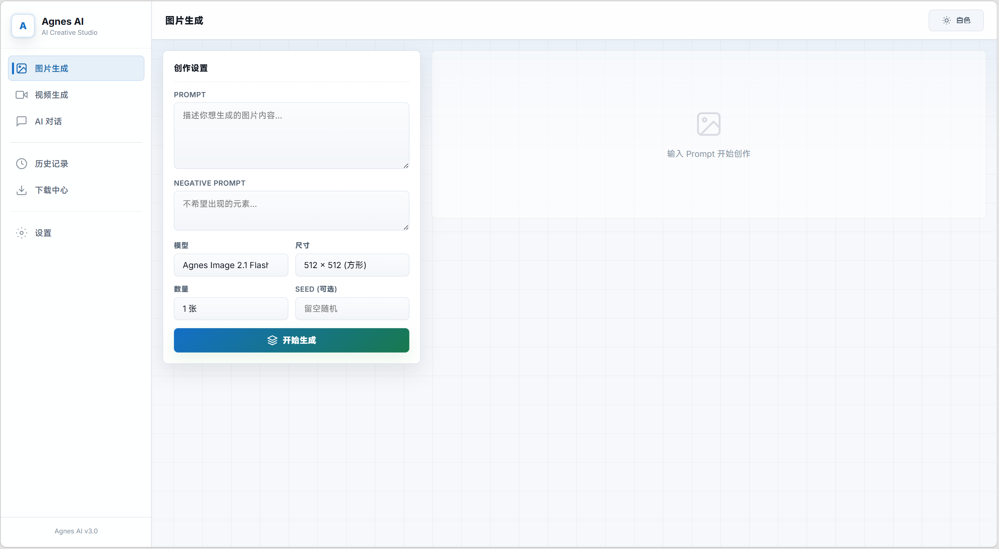
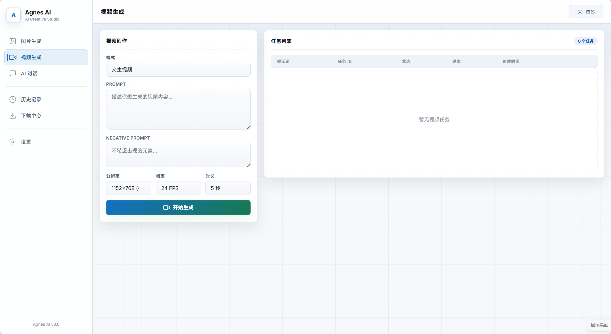
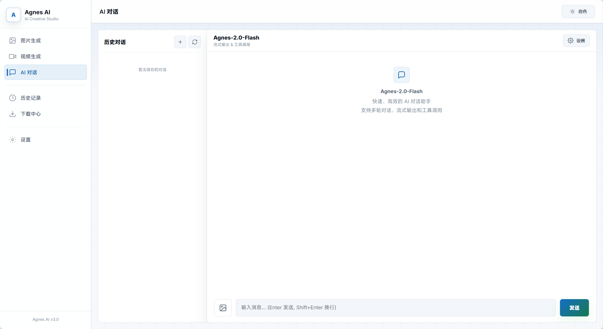
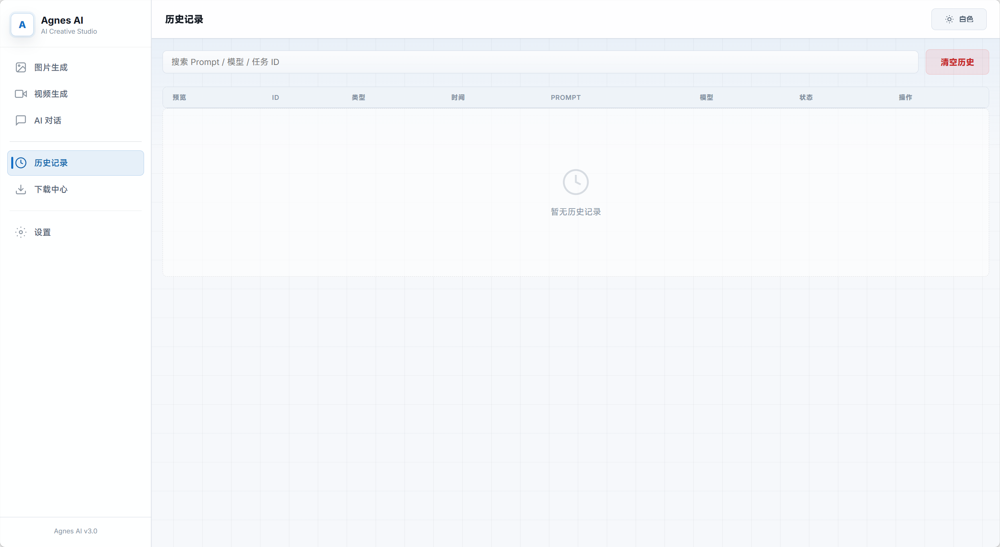
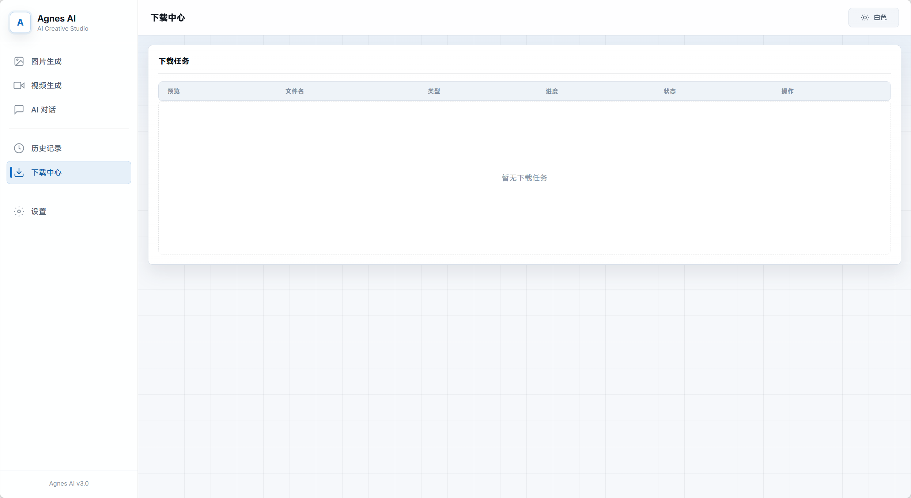

# Agnes AI Studio

> AI Creative Studio — 一站式 AI 图片生成、视频生成、智能对话创作平台

Agnes AI Studio 是一个基于 Agnes AI 服务的创意工作站，提供网页端与桌面客户端两种使用方式。集成文生图、图生图、文生视频、图生视频、AI 对话（含工具调用）、下载管理、历史记录等完整创作流程。

## 功能特性

### 图片生成

输入文字描述，AI 自动生成高质量图片。支持多种生成模型（文生图 / 图生图），可自定义图片尺寸（1024x1024、1024x1536、1536x1024），单次批量生成 1~4 张。支持上传参考图片进行风格化或变体生成，可设置负面提示词排除不想要的元素。生成结果以瀑布流展示，支持全屏预览、右键保存、一键全部保存。

### 视频生成

支持文字生成视频和图片生成视频两种模式。可配置视频分辨率（横版 1152x768 / 竖版 768x1152）、帧率和时长。图片生成视频支持本地图片拖拽或点击上传，自动转换为 data URI 传输。视频任务为异步处理，通过 WebSocket 实时推送进度和状态更新，支持自适应轮询策略。完成后可直接在页面内预览播放，支持暂停、进度拖动、循环播放。可随时取消正在生成的任务。

### AI 对话

多轮流式对话，支持与 Agnes-2.0-Flash 模型进行连续交流。具备工具调用能力 — 在对话中可直接让 AI 生成图片或视频，AI 会自动调用对应工具并返回结果，无需切换页面。对话内容实时流式显示，支持上传多张图片让 AI 分析。可创建多个独立对话会话，支持切换、重命名和删除。可配置系统提示词、模型选择、温度（Temperature）、Top-P、最大 Token 数等高级参数。支持随时中断生成。

### 历史记录

自动保存所有图片和视频生成的完整历史，包括使用的提示词、模型参数和生成结果。支持关键词搜索，提供图片和视频的缩略图预览（视频显示封面帧）。每条记录均可使用相同参数重新生成，或下载结果文件。

### 下载中心

集中管理所有文件下载任务，支持断点续传、暂停和恢复。实时显示下载进度、文件大小和任务状态。下载完成后支持直接预览和打开文件所在目录。

### 设置

配置 API Key 和自定义 API 服务地址（Base URL）。支持亮色 / 暗色主题切换。

## 界面预览

<p align="center">
  
  
</p>
<p align="center">
  
  
</p>
<p align="center">
  
</p>

## 快速开始

### 环境要求

- Python 3.12+
- Windows / macOS / Linux

### 安装

```bash
git clone https://github.com/kiocou/AgnesAI.git
cd AgnesAI
python -m venv .venv
```

**Windows:**
```powershell
.\.venv\Scripts\Activate.ps1
pip install -r requirements.txt
```

**macOS / Linux:**
```bash
source .venv/bin/activate
pip install -r requirements.txt
```

### 运行

启动 Web 服务：

```bash
python web_app.py
```

访问 [http://localhost:8765](http://localhost:8765) 即可使用。

首次启动会自动创建 `config/config.json`。在设置页面填写 API Key 并保存即可开始使用。

默认 API 地址：`https://apihub.agnes-ai.com/v1`

### 桌面客户端（可选）

项目同时提供基于 PySide6 的原生桌面客户端，入口为 `main.py`：

```bash
python main.py
```

## 打包发布

使用项目内的 spec 文件进行 PyInstaller 打包：

```bash
pyinstaller --clean --noconfirm AgnesAI.spec
```

打包产物位于 `dist/AgnesAI.exe`。运行时 `config`、`logs`、`database`、`history`、`downloads` 等目录会在 exe 所在目录自动创建。

## 项目结构

```
AgnesAI/
├── web_app.py              # FastAPI Web 服务入口
├── main.py                 # PySide6 桌面客户端入口
├── AgnesAI.spec            # PyInstaller 打包配置
├── requirements.txt        # Python 依赖
├── api/
│   ├── client.py           # Agnes API 客户端
│   ├── chat_api.py         # 对话生成接口
│   ├── image_api.py        # 图片生成接口
│   ├── video_api.py        # 视频生成接口
│   └── download.py         # 下载管理器
├── web/
│   └── index.html          # Web 前端（单文件应用）
├── ui/                     # PySide6 桌面 UI 模块
├── config/
│   ├── app_config.py       # 配置管理
│   └── config.example.json # 配置示例
├── database/
│   └── history_db.py       # SQLite 历史记录数据库
├── utils/
│   ├── logging_utils.py    # 日志工具
│   └── path_utils.py       # 路径工具
└── assets/
    └── frontend_page_photos/  # 界面截图
```

## API 接口

项目使用 OpenAI 兼容风格的 API 接口：

| 功能 | 端点 |
|------|------|
| 图片生成 | `POST /v1/images/generations` |
| 视频创建 | `POST /v1/videos` |
| 视频查询 | `GET /v1/videos/{task_id}` |
| 对话补全 | `POST /v1/chat/completions` |

## 异常处理

客户端覆盖完整的异常场景：401 鉴权失败、403 权限不足、429 限流、500/503 服务异常、网络超时/断连、API 余额不足、视频任务失败、下载中断等。详细请求日志写入 `logs/app.log`。

## 许可证

本项目仅供学习和研究使用。
