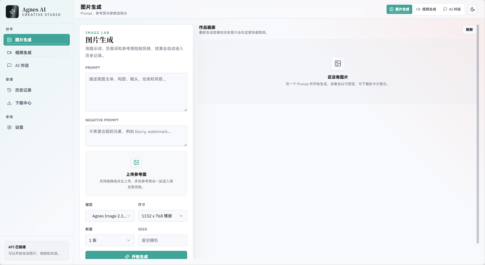
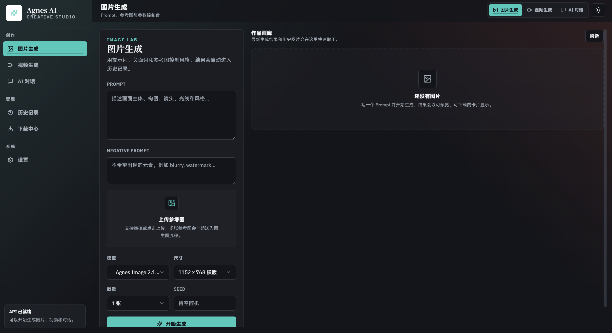
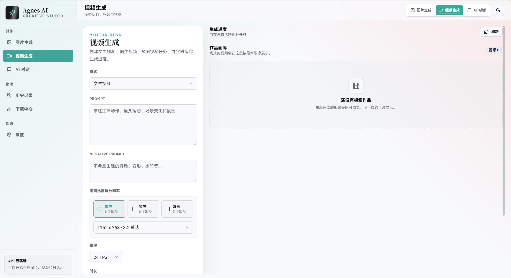
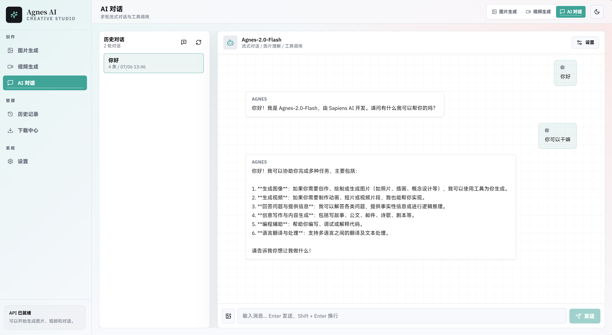
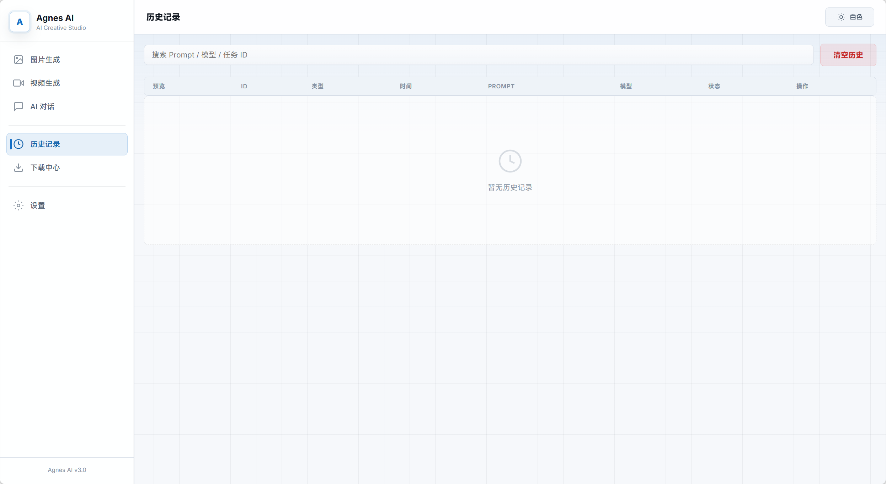
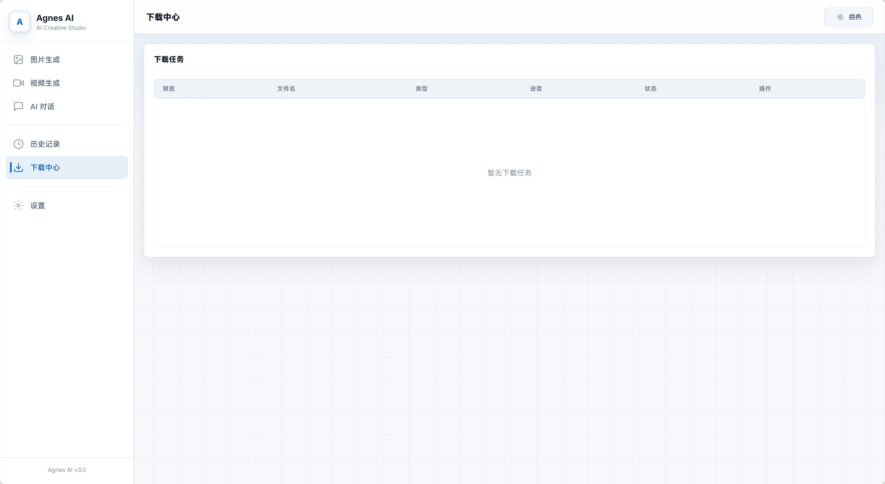

# Agnes AI Studio

Agnes AI Studio 是一个本地运行的 AI 创作工作台，面向图片生成、视频生成、流式 AI 对话、素材历史管理和下载队列。项目采用 FastAPI 后端 + React/Vite 前端，支持 OpenAI 兼容风格的 Agnes API 接口。

当前版本：`3.2.0`

## 界面预览

<p align="center">
  
  
</p>
<p align="center">
  
  
</p>
<p align="center">
  
  
</p>

## 功能总览

### 图片生成

- 支持 `agnes-image-2.1-flash` 与 `agnes-image-2.0-flash`。
- 支持文生图和多参考图图生图。
- 支持 Prompt、Negative Prompt、尺寸、数量和 Seed 参数。
- 单次可生成 1 到 4 张图片。
- 生成结果会自动下载到本地历史目录，并写入 SQLite 历史记录。
- 图片画廊支持刷新、预览和加入下载队列。

### 视频生成

- 支持 `agnes-video-v2.0`。
- 支持文生视频、图生视频、多图视频和关键帧动画。
- 支持横屏、竖屏、方形三类分辨率预设。
- 支持 24 FPS，视频时长可在 5 到 18 秒之间选择。
- 图生视频可上传参考图，也可从图片生成历史中选择素材。
- 视频任务会保存到数据库，前端会轮询任务进度。
- 支持任务取消、进度显示、完成后预览和加入下载队列。
- 后端包含队列超时检测、轮询重试、视频 URL 兼容解析和 Google Cloud Storage 代理下载兜底。

### AI 对话

- 支持 `agnes-2.0-flash` 多轮流式对话。
- 支持图片上传与图像理解消息。
- 支持系统提示词、Temperature、Top P、Max Tokens 配置。
- 支持停止正在生成的流式回复。
- 对话支持自动保存、切换、新建和删除。
- 对话内置 `generate_image` 与 `generate_video` 工具调用，模型可在聊天中直接触发图片或视频生成。

### 历史记录

- 集中展示图片和视频生成记录。
- 支持按 Prompt、模型或任务 ID 搜索。
- 支持图片/视频预览、下载和单条删除。
- 支持清空全部生成历史。
- 图片历史会保留结果 URL 与本地缓存路径；视频历史会保留任务 ID、状态、进度、结果 URL 和本地路径。

### 下载中心

- 所有图片和视频下载任务统一进入下载队列。
- 后台线程自动处理队列任务。
- 支持下载进度、状态、保存路径展示。
- 支持已完成文件预览。
- 支持失败任务重试和任务删除。

### 设置与体验

- 首次启动会引导填写 API Key 和 Base URL。
- 保存配置时会调用对话接口进行验证。
- API Key 以掩码形式展示，空输入会沿用已保存密钥。
- 支持亮色/暗色主题切换，主题偏好保存在浏览器本地。
- 支持桌面宽屏侧边栏和移动端底部导航。

## 技术栈

- 后端：Python、FastAPI、Pydantic、SQLite、Requests、Uvicorn
- 前端：React、TypeScript、Vite、Tailwind CSS、Radix UI、lucide-react
- 打包：PyInstaller

## 环境要求

- Python 3.12+
- Node.js 18+
- Windows / macOS / Linux

## 快速开始

### 1. 安装 Python 依赖

Windows:

```powershell
python -m venv .venv
.\.venv\Scripts\Activate.ps1
pip install -r requirements.txt
```

macOS / Linux:

```bash
python -m venv .venv
source .venv/bin/activate
pip install -r requirements.txt
```

### 2. 安装前端依赖

```bash
cd web
npm install
cd ..
```

### 3. 启动开发环境

先启动后端：

```bash
python web_app.py
```

再启动前端开发服务：

```bash
cd web
npm run dev
```

访问：

- 前端开发预览：<http://127.0.0.1:5173>
- 后端服务：<http://127.0.0.1:8765>

Vite 开发服务会把 `/api` 和 `/ws` 代理到本地 FastAPI 后端。

## 生产构建与运行

构建前端静态资源：

```bash
cd web
npm run build
cd ..
```

启动后端：

```bash
python web_app.py
```

后端会优先加载 `web/dist` 中的 Vite 构建产物。访问：

```text
http://127.0.0.1:8765
```

## 打包发布

```bash
pyinstaller --clean --noconfirm AgnesAI.spec
```

打包产物位于：

```text
dist/AgnesAI.exe
```

PyInstaller 配置会把 `web` 目录打入应用，运行时会在程序目录旁创建配置、日志、数据库、历史和下载目录。

## 常用脚本

前端脚本位于 `web/package.json`：

| 命令 | 说明 |
| --- | --- |
| `npm run dev` | 启动 Vite 开发服务 |
| `npm run build` | TypeScript 检查并构建生产资源 |
| `npm run preview` | 预览已构建的前端资源 |

后端入口：

```bash
python web_app.py
```

可通过环境变量指定后端端口：

```bash
AGNESAI_PORT=8765 python web_app.py
```

## API 接口

### 配置

| 方法 | 路径 | 说明 |
| --- | --- | --- |
| `GET` | `/api/config` | 获取配置状态和 Base URL |
| `POST` | `/api/config` | 保存并验证 API Key / Base URL |

### 图片

| 方法 | 路径 | 说明 |
| --- | --- | --- |
| `POST` | `/api/image/generate` | 生成图片 |
| `GET` | `/api/image/history` | 获取图片历史素材 |
| `POST` | `/api/upload-image` | 上传图片并转换为 data URI |

### 视频

| 方法 | 路径 | 说明 |
| --- | --- | --- |
| `POST` | `/api/video/create` | 创建视频任务 |
| `GET` | `/api/video/tasks` | 获取全部视频任务 |
| `GET` | `/api/video/poll/{task_id}` | 查询单个视频任务 |
| `GET` | `/api/video/poll-all` | 批量轮询活跃任务 |
| `GET` | `/api/video/poll-all-async` | 异步批量轮询活跃任务 |
| `POST` | `/api/video/cancel/{task_id}` | 标记任务为取消 |
| `GET` | `/api/video/stream/{task_id}` | 代理播放视频结果 |
| `WS` | `/ws/video-tasks` | 视频任务状态推送 |

### 对话

| 方法 | 路径 | 说明 |
| --- | --- | --- |
| `POST` | `/api/chat/completions` | 非流式对话 |
| `POST` | `/api/chat/stream` | SSE 流式对话与工具调用 |
| `POST` | `/api/chat/save` | 保存对话 |
| `GET` | `/api/chat/conversations` | 获取对话列表 |
| `GET` | `/api/chat/conversations/{conversation_id}` | 获取单个对话 |
| `DELETE` | `/api/chat/conversations/{conversation_id}` | 删除单个对话 |
| `DELETE` | `/api/chat/conversations` | 清空全部对话 |

### 历史、下载与文件

| 方法 | 路径 | 说明 |
| --- | --- | --- |
| `GET` | `/api/history` | 搜索图片和视频历史 |
| `DELETE` | `/api/history/{kind}/{record_id}` | 删除单条历史 |
| `DELETE` | `/api/history` | 清空生成历史 |
| `POST` | `/api/download` | 添加下载任务 |
| `GET` | `/api/downloads` | 获取下载队列 |
| `DELETE` | `/api/download/{download_id}` | 删除下载任务 |
| `POST` | `/api/download/{download_id}/retry` | 重试下载任务 |
| `GET` | `/api/file` | 读取本地文件用于预览 |
| `GET` | `/api/logs` | 查看最近日志 |
| `GET` | `/api/logs/download` | 下载日志文件 |

## 数据与文件目录

```text
config/config.json        # 本地 API Key 与 Base URL，已被 .gitignore 忽略
database/history.db       # SQLite 数据库，已被 .gitignore 忽略
history/images/           # 图片生成本地缓存
history/videos/           # 视频生成本地缓存
downloads/                # 下载中心保存目录
logs/app.log              # 后端运行日志
web/dist/                 # 前端生产构建产物
```

这些运行时文件不会提交到 Git。首次启动时后端会自动创建缺失目录。

## 项目结构

```text
.
├── web_app.py              # FastAPI 服务入口、路由、任务轮询与静态资源托管
├── requirements.txt        # Python 依赖
├── AgnesAI.spec            # PyInstaller 打包配置
├── api/
│   ├── client.py           # Agnes API 客户端、错误处理、SSE 解析
│   ├── image_api.py        # 图片生成与下载
│   ├── video_api.py        # 视频任务创建、查询、下载与 URL 解析
│   ├── chat_api.py         # 对话补全与流式响应解析
│   └── download.py         # 下载任务后端逻辑
├── config/
│   └── app_config.py       # 配置读写
├── database/
│   └── history_db.py       # SQLite 表结构与历史/下载/对话数据访问
├── utils/
│   ├── path_utils.py       # 运行目录与安全文件名
│   └── logging_utils.py    # 日志配置
├── web/
│   ├── package.json        # 前端依赖与脚本
│   ├── vite.config.ts      # Vite 配置与 API 代理
│   └── src/                # React 前端源码
└── assets/
    └── frontend_page_photos/
```

## 常见问题

### 页面提示需要配置 API Key

进入设置页或首次启动弹窗，填写 API Key 和 Base URL。默认 Base URL：

```text
https://apihub.agnes-ai.com/v1
```

### 前端页面能打开，但接口请求失败

确认后端已经运行在 `http://127.0.0.1:8765`。开发模式下 Vite 会把接口代理到这个地址。

### 视频长时间停留在队列中

后端会对排队和处理中状态做超时检测。可以在视频页手动刷新或取消任务，也可以查看 `logs/app.log` 定位服务端返回。

### 下载失败

下载中心支持失败任务重试。图片和视频下载逻辑包含网络重试；部分 Google Cloud Storage 链接会自动尝试代理兜底。

## 许可证

本项目仅供学习和研究使用。
